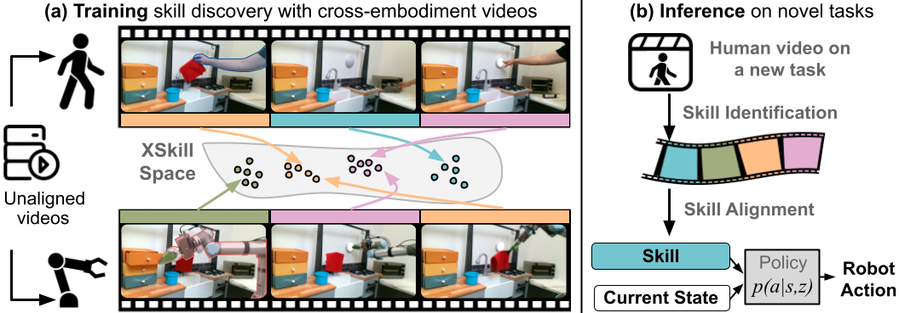

# XSkill: Cross Embodiment Skill Discovery

<sup>1,</sup><sup>2</sup>[Mengda Xu](https://mengdaxu.github.io/),  <sup>1,</sup>[Zhenjia Xu](https://www.zhenjiaxu.com/),  <sup>1</sup>[Cheng Chi](https://cheng-chi.github.io/),  <sup>2,</sup><sup>3</sup>[Manuela Veloso](https://www.cs.cmu.edu/~mmv/),  <sup>1</sup>[Shuran Song](https://shurans.github.io/)

<sup>1</sup>Columbia University,  <sup>2</sup>JP Morgan AI Research,<sup>3</sup>CMU  

**CoRL 2023** 

[Project Page](https://xskill.cs.columbia.edu/)|[arxiv](https://arxiv.org/pdf/2307.09955.pdf)

This repository contains code for training and evaluating XSkill in both simulation and real-world settings.


## 🚀 Installation

Follow these steps to install `XSkill`:

1. Create and activate the conda environment:
   ```bash
   cd xskill
   conda env create -f environment.yml
   conda activate xskill
   pip install -e . 
   ```

## 📦 Simulation Dataset

To set up the simulation dataset:

1. Create a new directory for datasets under XSkill:
   ```bash
   mkdir datasets
   cd datasets
   wget https://xskill.cs.columbia.edu/data/kitchen.zip
   unzip kitchen.zip
   ```
2. Set the `base_dev_dir` config/simulation/create_kitchen_datase.yaml to your working directory. Run the following command to generate the cross-embodiment kitchen data and the training mask:
    ```bash
    cd scripts
    python create_all_kitchen_dataset.py
    python extract_kitchen_info.py
    ```

## 🌐 Real World Dataset
To Download the real world kitchen dataset:
   ```bash
   mkdir datasets
   cd datasets
   wget https://xskill.cs.columbia.edu/data/real_kitchen_data.zip
   ```
## 🚴‍♂️ Training

### Simulation

1. Run the skill discovery script:
   ```bash
   python scripts/skill_discovery.py
   ```
2. Label the dataset using the learned prototype by the trained model. 
    ```bash
    python scripts/label_sim_kitchen_dataset.py
    ```
3. Execute the skill transfer and composing script. Replace the pretrain_path and pretrain_ckpt in cfg/simulation/skill_transfer_composing.yaml
    ```
    python scripts/skill_transfer_composing.py
    ``` 
### Real World

1. Execute the real-world skill discovery script:
   ```bash
   python scripts/realworld/skill_discovery.py
   ``` 
2. Label the real-world dataset:
    ```bash
    python scripts/realworld/label_real_kitchen_dataset.py
    ``` 
3. 📊 Visualization

    Open the provided Jupyter notebook `viz_real.ipynb` to visualize the learned prototypes:

### BibTeX
   ```bash
   @inproceedings{
        xu2023xskill,
        title={{XS}kill: Cross Embodiment Skill Discovery},
        author={Mengda Xu and Zhenjia Xu and Cheng Chi and  Manuela Veloso and Shuran Song},
        booktitle={7th Annual Conference on Robot Learning},
        year={2023},
        url={https://openreview.net/forum?id=8L6pHd9aS6w}
        }
   ``` 
### License
This repository is released under the MIT license. 

### Acknowledgement
* Diffusion Policy is adapted from [Diffusion Policy](https://github.com/real-stanford/diffusion_policy)
* Many useful utilies are adapted from [XIRL](https://x-irl.github.io/).